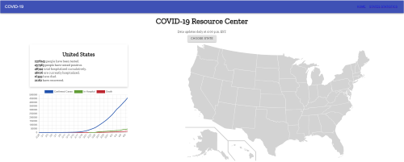
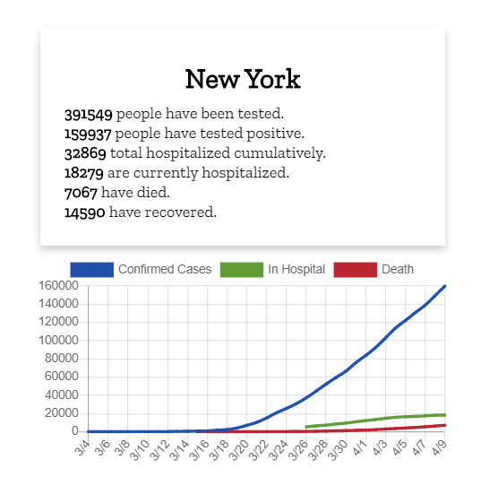

# covid-19

COVID-19 Resource Center
A website allowing users real easy to read data on the coronavirus.

## Motivation

Allowing the genral public access to public data on the current state of the virus.

## Build status

Curently deployed: https://hchamorro.github.io/covid-19/

## Code style

React App utilizing JavaScript

## Screenshots

Home Page Display:



State Data Display:



## Tech/framework used

Ex. -

<b>Built with</b>

- [Material-UI](https://material-ui.com/)
- [Chart.js](https://www.chartjs.org/docs/latest/)

## Installation

After cloning this repo:

```
npm install
```

```
npm start
```

Will be running on localhost.

## API Reference

- [The Covid Tracking Project](https://covidtracking.com/)

## Contribute

Pull requests are welcome. For major changes, please open an issue first to discuss what you would like to change.

Please make sure to update tests as appropriate.

## Credits

https://github.com/abbyblachman/covid-dashboard) for letting me colaberate with her before starting my own project

## License

MIT © [hchamorro]()
